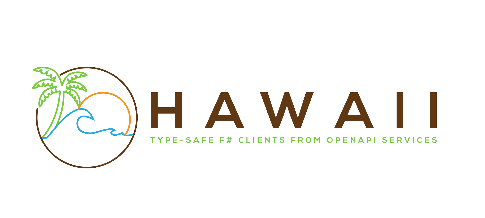

# Hawaii  [](https://www.nuget.org/packages/Hawaii)



A dotnet CLI tool to generate type-safe F# clients from OpenAPI documents.

### Install

```
dotnet tool install -g hawaii
```

### Configuration

Create a configuration file called `hawaii.json` with the following shape:
```
{
    "schema": <schema>,
    "project": <project>,
    "output": <output>,
    ["synchronous"]: <true | false>,
    ["asyncReturnType"]: <"async" | "task">,
    ["resolveReferences]": <true | false>
}
```
Where
 - `<schema>` is a URL to the OpenApi/Swagger location, whether that is an external URL or a relative file path
 - `<project>` is the name of the project that will get generated
 - `<output>` is a relative path to the output directory where the project will be generated. (Note: this directory is deleted and re-generated when you run `hawaii`)
 - `<synchronous>` is an optional flag that determines whether hawaii should generate client methods that run http requests synchronously. This is useful when used inside console applications. (set to false by default)
 - `<asyncReturnType>` is an option to determine whether hawaii should generate client methods that return `Async<'T>` when set to "async" (default) or `Task<'T>` when set to "task" (this option is irrelevant when the `synchronous` option is set to `true`)
 - `<resolveReferences>` determines whether hawaii will attempt to resolve external references via schema pre-processing. This is set to `false` by default but sometimes an OpenApi schema is scattered into multiple schemas across a repository and this might help with the resolution.

### Example
Here is an example configuration for the pet store API:
```json
{
    "schema": "https://petstore3.swagger.io/api/v3/openapi.json",
    "output": "./output",
    "project": "PetStore",
    "synchronous": true
}
```
After you have the configuration ready, run `hawaii` in the directory where you have the `hawaii.json` file:
```
hawaii
```
You can also tell hawaii where to find the configuration file if it wasn't name `hawaii.json`, for example
```
hawaii --config ./petstore-hawaii.json
```
### Using the generated project
Once hawaii has finished running, you find a full generated F# project inside of the `<output>` directory. This project can be referenced from your application so you can start using it.

You can reference the project like this from your app like this:
```xml
<ItemGroup>
  <ProjectReference Include="..\path\to\output\PetStore.fsproj" />
</ItemGroup>
```
Then from your code:
```fs
open System
open System.Net.Http
open PetStore
open PetStore.Types

let httpClient = new HttpClient(BaseAddress = Uri "https://petstore3.swagger.io/api/v3")
let petStore = PetStoreClient(httpClient)

let availablePets() =
    let status = PetStatus.Available.Format()
    match petStore.findPetsByStatus(status=status) with
    | FindPetsByStatus.OK pets -> for pet in pets do printfn $"{pet.name}"
    | FindPetsByStatus.BadRequest -> printfn "Bad request"

availablePets()
```
Notice that you have to provide your own `HttpClient` to the `PetStoreClient` and setting the `BaseAddress` to the base path of the service.
### Version
You can ask hawaii which version it is currently on:
```
hawaii --version
```
### Limitations
These are the very early days of Hawaii as a tool to generate F# clients and there are some known limitations and rough edges that I will be working on:
 - Fable support: coming soon
 - `anyOf`/`oneOf` not supported


> You can watch the live coding sessions as a playlist published on [YouTube here](https://www.youtube.com/watch?v=8dgjD6vG7yw&list=PLBzGkJMamtz0KCkK7OFnuXyXP7yUtnt9o)